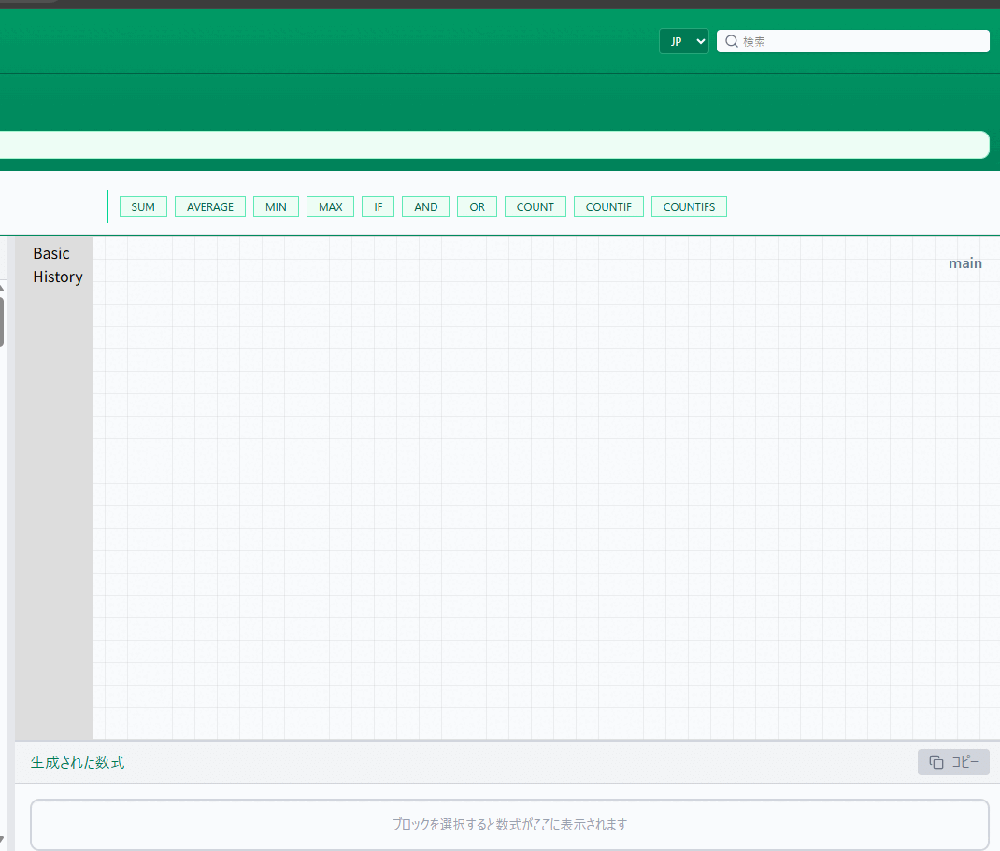

### Frockly (v0.5)

Frockly is a visual editor for understanding and refactoring complex Excel formulas.

Instead of reading long, deeply nested formulas as plain text,
Frockly represents formulas as blocks, making their structure explicit and easier to inspect.

Frockly is **not an Excel replacement**.
It focuses on helping you read, analyze, and reason about formulas before bringing them back to Excel.

## Demo

https://ryuu12358.github.io/Frockly/

(Desktop usage recommended)

## What Frockly does

- Build Excel formulas by assembling blocks
- Convert existing Excel formulas into block structures
- Inspect complex formulas using structural views (collapse, focus, root)
- Define and reuse named formulas
- Import data and formulas from xlsx files (experimental)
- Copy completed formulas back into Excel or spreadsheet tools

## What Frockly does NOT do

- Edit cell values
- Recalculate formulas
- Save or modify Excel files

Frockly is designed for **understanding and refactoring**, not execution.

## Example

Same formula, different representation.

## Why

Excel formulas are often hard to understand not because they are complex,
but because their structure is hidden inside a single line of text.

When formulas grow, we end up mentally reconstructing their structure every time we read them.

Frockly externalizes that structure,
so you can see how a formula is built instead of re-deriving it in your head.

## Status

Current version: **v0.5**

Frockly has reached a point where most of the core ideas are implemented.
The project is still experimental, but it is usable for real inspection and refactoring workflows.

## Updates

- 2025-12-25 – v0.5: File tab, xlsx import, named function import/export
- 2025-12-22 – Added View tab for formula structure visualization and navigation
- 2025-12-20 – UI improvement: function description panel
- 2025-12-19 – Supported converting formulas into blocks
- 2025-12-17 – Initial public release

## Roadmap (rough)

- Check tab (structural diagnostics, let hints)
- Improved named function navigation
- Mobile-friendly editing experience

## Notes

This project explores a different way of interacting with formulas.
It does not aim to automate thinking or generate logic for you,
but to make the existing logic visible and easier to reason about.
